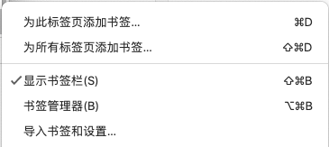
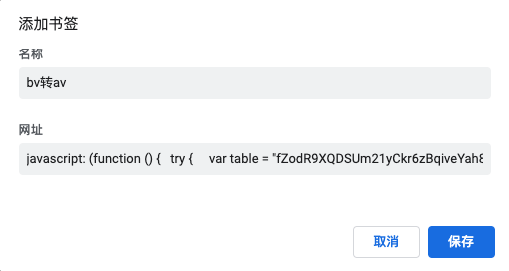

## 简介

众所周知Bilibili已经使用`bv`号全面取代`av`号，这里提供大家一个将`bv`号转换成`av`号的方法。

## 使用方法

以Chrome为例：

### Step 1: 打开书签管理器



### Step 2: 新建书签



复制下面这段代码并粘贴到书签的网址栏：

```js
javascript: (function () {
  try {
    var table = "fZodR9XQDSUm21yCkr6zBqiveYah8bt4xsWpHnJE7jL5VG3guMTKNPAwcF",
      tr = new Object();
    for (var i = 0; i < 58; i++) {
      tr[table[i]] = i;
    }
    var s = [11, 10, 3, 8, 4, 6],
      xor = 177451812,
      add = 8728348608;

    function dec(x) {
      var r = 0;
      for (var i = 0; i < 6; i++) {
        r += tr[x[s[i]]] * 58 ** i;
      }
      return (r - add) ^ xor;
    }

    function enc(x) {
      x = (x ^ xor) + add;
      r = "BV1  4 1 7  ".split("");
      for (var i = 0; i < 6; i++) {
        r[s[i]] = table[Math.floor(x / 58 ** i) % 58];
      }
      return r.join("");
    }

    function getQueryBvStr() {
      var query = window.location.href;
      var begIndex = query.indexOf('/video/');
      var workStr = query.substring(begIndex + '/video/'.length, query.length);
      var bvReg = new RegExp("^[0-9a-zA-Z_]{1,}$");
      if (!bvReg.test(workStr)) {
        var endIndex = workStr.search(/\W/);
        workStr = workStr.substring(0, endIndex);
      }
      return workStr;
    }
    var avStr = 'av' + dec(getQueryBvStr());
    var jumpTo = 'https://www.bilibili.com/video/' + avStr;
    window.location = jumpTo;
  } catch (e) {
    alert(e);
  }
})();
```

### Step 3: 打开一部B站视频

例子：https://www.bilibili.com/video/BV1Ax411A79R

### Step 4: 点击刚刚创建的书签就会跳转到对应的`av`号的视频页面了

例子：https://www.bilibili.com/video/av1928618

## 参考

转换算法参考：[知乎：mcfx的回答](https://www.zhihu.com/question/381784377/answer/1099438784)